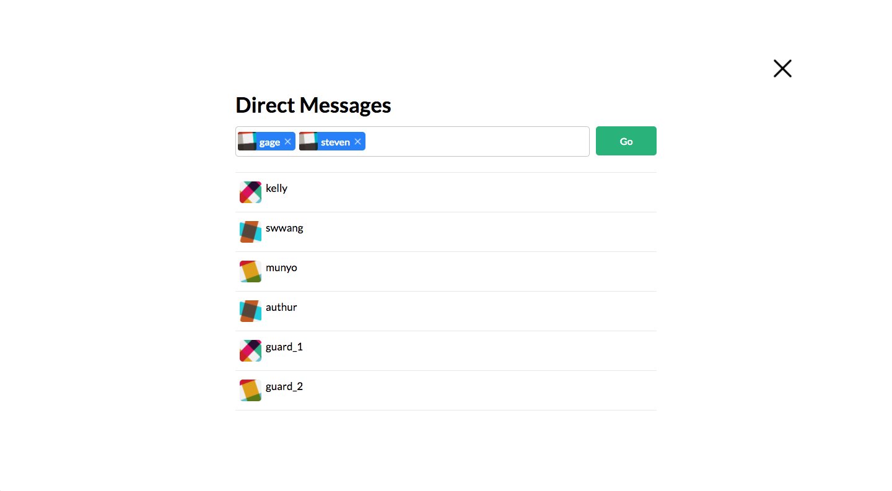

# Slack

My project is a full-stack web application modeled after a Slack clone, a popular group messaging application.  It is built using a React/Redux frontend, a Ruby on Rails backend,  and a PostgreSQL database.

[Checkout the live version here!](https://slackerio.herokuapp.com/)

### Screenshots

###### Login Page


###### Main App


###### New Channel


###### Direct-Message Form


### Features
- Account Creation
- Log in/ Log out
- Real-time live messaging
- Group channels
- Private Direct-Messaging

### Technology Used
 - Ruby on Rails
 - React.js
 - Redux
 - PostgreSQL
 - Heroku

## Main Features

### Real-time Channel and Direct Messaging
  The primary feature of the application is real-time messaging cross groups and direct messages.  Each message holds the foreign key to the channel to which they belong to, and direct messages and groups both fall under the same channel model.

  Initially, a user would subscribe via a websocket to all channels that they were a member of, but this provided unique challenges for direct messages as users could not be subscribed to channels that does not exist initially.

  For example, if user A wanted to message user B and has not done so previously, it would require the creation of a new channel.  It would be unfeasible to have every user subscribe to every possible combination of a direct message.

  This problem was solved by having a user subscribe to their own websocket under their userId, instead allowing the rails server to designate which user channels to send the messages.  This permits users to receive all messages from all channels designated for them.

  ```
  message.rb

  after_commit :send_message

  def send_message()
    self.channel.members.each do |member|
      MessageRelayJob.perform_later(self, "user_#{member.id}")
    end
  end
  ```

## Future Features
  I will be including a 'current online users feature', which will indicate which users are online and can be messaged immediately.  Furthermore, I will also include a channel search feature and user profile updates.
